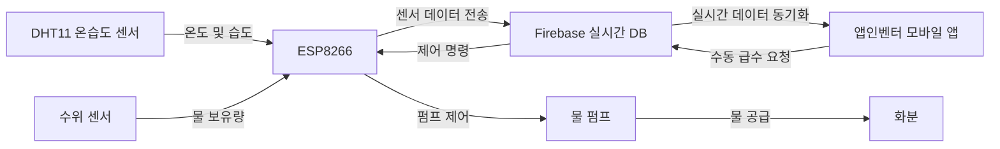
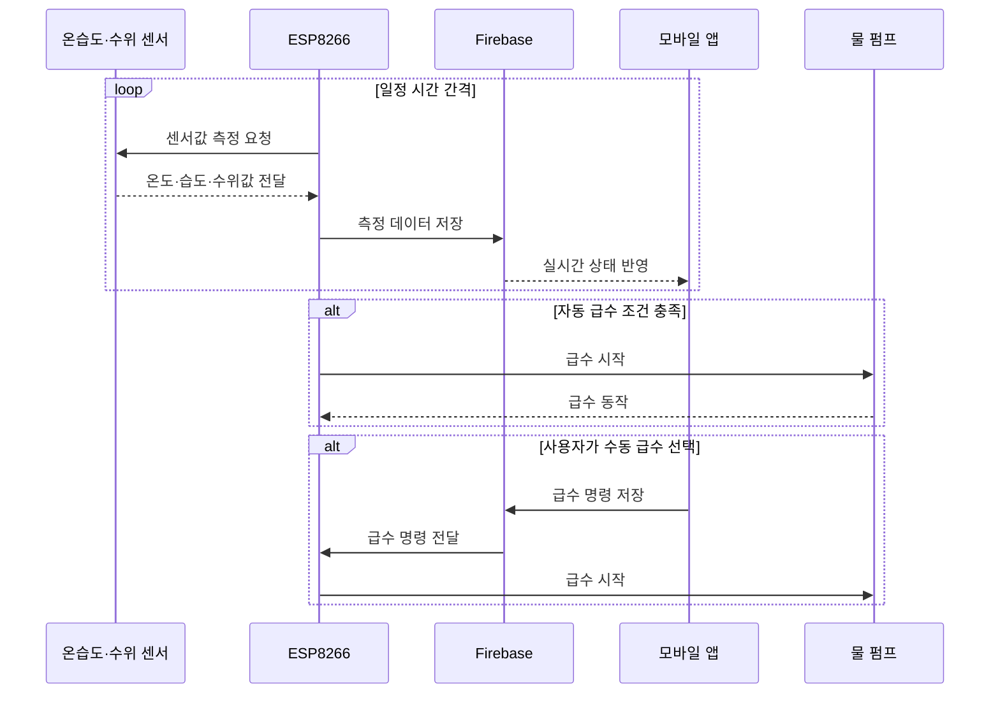

# Doge 스마트 화분

> **ESP8266과 Firebase를 활용한 사물인터넷 기반 자동 식물 관리 시스템**

Doge 스마트 화분은 온도, 습도, 물의 양을 측정하고 식물의 상태에 따라 자동으로 물을 공급하는 사물인터넷 화분입니다.

ESP8266을 이용하여 센서 데이터를 Firebase 실시간 데이터베이스에 전송하며, 사용자는 앱인벤터로 제작한 안드로이드 앱에서 화분의 상태를 원격으로 확인하고 급수 장치를 제어할 수 있습니다.

<p align="center">
  
</p>

---

## 프로젝트 개요

| 구분 | 내용 |
|---|---|
| 프로젝트명 | Doge 스마트 화분 |
| 참가 행사 | 제2회 대구 메이커 페스타 |
| 개발 형태 | 2인 팀 프로젝트 |
| 개발 분야 | 사물인터넷, 임베디드 시스템, 모바일 응용프로그램 |
| 핵심 장치 | ESP8266 |
| 데이터베이스 | Firebase 실시간 데이터베이스 |
| 모바일 구현 | MIT 앱인벤터 |
| 주요 기능 | 자동 급수, 온습도 측정, 수위 확인, 원격 상태 확인 |
| 개발 언어 | 아두이노 기반 C/C++ |
| 수상 내역 | 대구 메이커 페스타 아이디어상 |

---

## 프로젝트 소개

현대인은 학업과 업무 등으로 인해 식물을 정기적으로 관리하기 어려운 경우가 많습니다.

특히 물을 주는 시기를 놓치거나 화분 주변의 온도와 습도를 확인하지 못하면 식물이 쉽게 시들 수 있습니다.

Doge 스마트 화분은 이러한 문제를 해결하기 위해 다음 기능을 하나의 시스템으로 구현했습니다.

- 화분 주변 온도 측정
- 화분 주변 습도 측정
- 물통의 물 보유량 확인
- 설정 조건에 따른 자동 급수
- 모바일 앱을 통한 상태 확인
- 모바일 앱을 통한 수동 급수
- Firebase를 이용한 센서 데이터 저장 및 동기화

---

## 핵심 기능

### 자동 급수

온습도 센서를 이용해 화분 주변 환경을 측정하고, 설정된 조건에 따라 물 펌프를 작동시킵니다.

```text
센서 데이터 측정
       ↓
현재 환경 상태 확인
       ↓
급수가 필요한지 판단
       ↓
물 펌프 작동
       ↓
식물에 물 공급
```

자동 급수 기능을 통해 사용자가 직접 물을 주지 않아도 일정한 환경을 유지할 수 있도록 구성했습니다.

---

### 온도 및 습도 측정

DHT11 센서를 이용하여 화분 주변의 온도와 습도를 측정합니다.

측정값은 ESP8266을 통해 Firebase 실시간 데이터베이스로 전송됩니다.

| 측정 데이터 | 설명 |
|---|---|
| 온도 | 화분 주변의 현재 온도 |
| 습도 | 화분 주변의 현재 공기 습도 |
| 측정 주기 | 일정 시간 간격으로 반복 측정 |
| 저장 위치 | Firebase 실시간 데이터베이스 |

---

### 물의 양 확인

수위 센서를 이용하여 물통에 남아 있는 물의 양을 측정합니다.

사용자는 앱에서 현재 물 보유량을 확인하고 물통 보충 시기를 판단할 수 있습니다.

```text
수위 센서
   ↓
ESP8266
   ↓
Firebase
   ↓
스마트폰 앱
```

---

### 모바일 앱 연동

MIT 앱인벤터를 이용하여 안드로이드 앱을 제작했습니다.

앱에서는 다음 기능을 제공합니다.

- 현재 온도 확인
- 현재 습도 확인
- 물 보유량 확인
- 급수 장치 상태 확인
- 수동 급수 기능
- Firebase 데이터 실시간 반영

<p align="center">
  
</p>

---

## 시스템 구조



---

## 데이터 처리 과정



---

## 하드웨어 구성

| 부품 | 사용 목적 |
|---|---|
| ESP8266 | 센서 제어, 무선 통신, Firebase 연동 |
| DHT11 | 온도 및 습도 측정 |
| 수위 센서 | 물통의 물 보유량 측정 |
| 물 펌프 | 식물에 물 공급 |
| 모터 구동 회로 | 물 펌프 전원 제어 |
| 브레드보드 | 회로 구성 및 테스트 |
| 점퍼선 | 센서와 ESP8266 연결 |
| 화분 및 물통 | 스마트 화분 시제품 구성 |

---

## 사용 기술

### 임베디드

- ESP8266
- Arduino IDE
- 아두이노 기반 C/C++
- 디지털 및 아날로그 센서 입력
- 물 펌프 출력 제어
- Wi-Fi 통신

### 데이터베이스

- Firebase 실시간 데이터베이스
- 실시간 센서 데이터 저장
- 모바일 앱과 ESP8266 데이터 동기화
- 원격 제어 명령 전달

### 모바일 앱

- MIT 앱인벤터
- Firebase 데이터 연동
- 센서값 표시
- 급수 버튼 구현
- 안드로이드 응용프로그램 제작

---

## 사용 라이브러리

```cpp
#include <DHT.h>
#include <ESP8266WiFi.h>
#include <SimpleTimer.h>
#include <FirebaseESP8266.h>
```

| 라이브러리 | 사용 목적 |
|---|---|
| DHT | DHT11 센서의 온도와 습도 측정 |
| ESP8266WiFi | ESP8266의 무선망 연결 |
| SimpleTimer | 센서 측정 및 데이터 전송 주기 관리 |
| FirebaseESP8266 | ESP8266과 Firebase 연동 |

저장소의 주요 언어는 C++이며, 앱인벤터와 Firebase를 함께 사용해 전체 시스템을 구성했습니다. :contentReference[oaicite:1]{index=1}

---

## 회로 구성

### 온습도 센서

```text
DHT11 VCC  → 전원
DHT11 GND  → 접지
DHT11 DATA → ESP8266 디지털 핀
```

<p align="center">
  
</p>

### 수위 센서

```text
수위 센서 VCC → 전원
수위 센서 GND → 접지
수위 센서 OUT → ESP8266 입력 핀
```

<p align="center">
  
</p>

### 물 펌프

ESP8266의 출력 신호를 이용하여 물 펌프를 작동시킵니다.

ESP8266 핀에서 펌프를 직접 구동할 수 없으므로 트랜지스터, 릴레이 또는 모터 구동 회로를 통해 전원을 제어해야 합니다.

<p align="center">
  
</p>

---

## 주요 소스 코드

프로젝트의 주요 아두이노 코드는 다음 파일에서 확인할 수 있습니다.

```text
LASTCODE.ino
```

소스 코드에서는 다음 처리를 담당합니다.

- ESP8266 무선망 연결
- DHT11 센서값 측정
- 수위 센서값 측정
- Firebase 데이터 전송
- Firebase 제어값 수신
- 물 펌프 작동
- 자동 급수 조건 판단
- 일정 시간 간격의 반복 처리

---

## 실행 방법

### Arduino IDE 준비

Arduino IDE에 ESP8266 보드 패키지를 설치합니다.

다음 라이브러리를 설치합니다.

- DHT 센서 라이브러리
- SimpleTimer
- Firebase ESP8266
- ESP8266 Wi-Fi

### Firebase 설정

Firebase 프로젝트를 생성하고 실시간 데이터베이스를 활성화합니다.

소스 코드에 자신의 Firebase 주소와 인증정보를 설정합니다.

```cpp
#define FIREBASE_HOST "YOUR_FIREBASE_HOST"
#define FIREBASE_AUTH "YOUR_FIREBASE_AUTH"
```

### 무선망 설정

```cpp
#define WIFI_SSID "YOUR_WIFI_SSID"
#define WIFI_PASSWORD "YOUR_WIFI_PASSWORD"
```

### ESP8266 업로드

1. ESP8266을 컴퓨터에 연결합니다.
2. Arduino IDE에서 ESP8266 보드를 선택합니다.
3. 연결된 통신 포트를 선택합니다.
4. `LASTCODE.ino`를 엽니다.
5. 코드를 컴파일하고 업로드합니다.
6. 직렬 모니터에서 무선망과 Firebase 연결 상태를 확인합니다.

### 모바일 앱 실행

저장소의 앱인벤터 프로젝트 파일을 MIT 앱인벤터에 가져옵니다.

```text
android_app_last.aia
```

스마트폰에 완성된 응용프로그램을 설치하려면 다음 파일을 사용할 수 있습니다.

```text
flowerpot.apk
```

---

## 저장소 구조

```text
.
├── README.md
├── LASTCODE.ino
├── android_app_last.aia
├── flowerpot.apk
├── LICENSE
├── 대구메이커페스타상.png
├── 유튜브 주소.docx
├── 참여신청서
├── 라이브러리
└── image
```

---

## 개발 결과

- ESP8266과 무선망 연결
- DHT11 온도 및 습도 측정
- 수위 센서를 이용한 물 보유량 확인
- Firebase 실시간 데이터베이스 연동
- 물 펌프 자동 제어
- 모바일 앱을 통한 화분 상태 확인
- 모바일 앱을 통한 원격 급수
- 앱인벤터 안드로이드 응용프로그램 제작
- 실제 동작 가능한 스마트 화분 시제품 완성
- 제2회 대구 메이커 페스타 아이디어상 수상

---

## 담당 역할

### 백주원

- 프로젝트 아이디어 기획
- ESP8266 기반 회로 구성
- 센서와 물 펌프 연결
- 아두이노 소스 코드 작성 및 수정
- Firebase 실시간 데이터베이스 연동
- 앱인벤터 모바일 앱 제작 참여
- 스마트 화분 시제품 제작
- 프로젝트 발표 및 문서 작성

---

## 팀 구성

| 이름 | 역할 |
|---|---|
| 백주원 | 회로설계, 하드웨어 제작, 아두이노 소스코드 구현 |
| 강민규 |회로설계, 작품제작, 앱인벤터 소스코드 구현 |

---

## 기술적 회고

### 잘된 점

- 센서 입력, 클라우드 데이터베이스, 모바일 앱, 물 펌프 출력을 하나의 시스템으로 연결했습니다.
- Firebase를 이용하여 센서 데이터를 실시간으로 확인할 수 있도록 구현했습니다.
- 자동 급수와 수동 급수를 함께 지원했습니다.
- ESP8266을 활용해 저비용 사물인터넷 시스템을 구현했습니다.
- 실제 화분에 적용할 수 있는 작동 가능한 시제품을 제작했습니다.
- 앱인벤터를 활용해 임베디드 장치와 연결되는 안드로이드 앱을 구현했습니다.

### 개선할 점

- Firebase 인증정보와 무선망 비밀번호를 환경 설정 파일로 분리
- 토양 수분 센서를 추가하여 실제 흙의 수분 상태 측정
- DHT11을 더 정밀한 온습도 센서로 교체
- 펌프의 연속 작동 시간을 제한하여 과급수 방지
- 물 부족 상태에서는 펌프가 작동하지 않도록 보호 기능 추가
- 센서 측정 실패와 무선망 연결 끊김에 대한 예외 처리
- 자동 급수 기준값을 앱에서 변경할 수 있도록 개선
- 시간대별 센서 데이터를 그래프로 표시
- 식물 종류별 권장 환경 설정 기능 추가
- 앱인벤터 화면 디자인과 사용자 경험 개선
- 하드웨어 배선을 인쇄회로기판으로 제작
- 절전 모드를 적용하여 소비 전력 감소

---

## 보안 주의사항

Firebase 인증정보와 무선망 이름 및 비밀번호를 공개 저장소에 직접 작성하면 안 됩니다.

```cpp
#define FIREBASE_HOST "YOUR_FIREBASE_HOST"
#define FIREBASE_AUTH "YOUR_FIREBASE_AUTH"
#define WIFI_SSID "YOUR_WIFI_SSID"
#define WIFI_PASSWORD "YOUR_WIFI_PASSWORD"
```

기존 코드에 실제 인증정보가 들어 있다면 Git 기록에서도 확인될 수 있으므로 해당 인증정보와 비밀번호를 변경해야 합니다.

---

## 프로젝트를 통해 얻은 경험

- ESP8266 기반 사물인터넷 시스템 구현
- DHT11 온습도 센서 활용
- 수위 센서의 아날로그 데이터 처리
- 물 펌프와 모터 구동 회로 제어
- Firebase 실시간 데이터베이스 연동
- 앱인벤터를 활용한 안드로이드 앱 제작
- 센서 입력과 원격 제어 기능 통합
- 자동 제어 조건 설계
- 팀 프로젝트 역할 분담과 협업
- 아이디어를 실제 시제품으로 구현하는 과정 경험

---

## 수상 내역

### 제2회 대구 메이커 페스타 아이디어상

ESP8266, 센서, Firebase, 모바일 앱을 결합하여 사용자가 직접 관리하지 않아도 식물의 환경을 확인하고 물을 공급할 수 있는 스마트 화분을 제작했습니다.

<p align="center">
  
</p>

---

## 관련 자료

- [아두이노 소스 코드](LASTCODE.ino)
- [앱인벤터 프로젝트](android_app_last.aia)
- [안드로이드 설치 파일](flowerpot.apk)
- [대구 메이커 페스타 수상 자료](대구메이커페스타상.png)
- [프로젝트 시연 영상](https://www.youtube.com/watch?v=P0Hf3BYsYAo)
